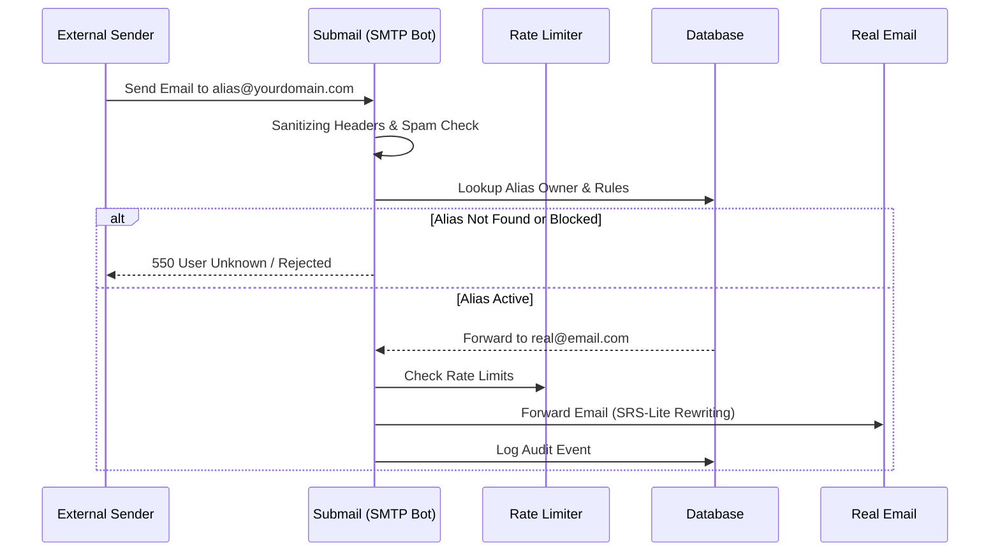

# Submail System


**A Secure, Self-Hosted Email Alias System for Discord Communities.**

[Architecture](#architecture) • [Features](#features) • [Configuration](#configuration-reference) • [Deployment](#deployment)

---

## 📖 Introduction

**Submail** is a privacy-focused email forwarding system designed for Discord communities. It allows designated users (e.g., your guild members) to create unlimited email aliases (like `netflix@yourdomain.com`) that forward to their real email address (`user@gmail.com`).

Unlike standard forwarding services, Submail is **Discord-gated**, meaning only users who are members of your specific Discord server can access the dashboard and create aliases.

---

## 🏗️ Architecture

The system consists of two main components: the **Web Dashboard** (Next.js 14) for management and the **SMTP Bot** (Node.js) for handling email traffic.



---

## 🚀 Features Deep Dive

### 🔐 1. Discord Gate (Identity & Access)
-   **Strict Membership Check**: Logins are only permitted if the user holds a valid token and is a member of the configured `DISCORD_GUILD_ID`.
-   **Security**: Uses server-side token validation to prevent client-side spoofing.
-   **Privacy**: Your Discord ID is hashed or mapped to an internal UUID (`providerId` vs `id`), ensuring internal database IDs are never exposed.

### 🛡️ 2. Defense-in-Depth Security
-   **Email Bypass & Anonymity**: Uses **SRS-Lite** (Sender Rewriting Scheme) logic. Forwarded emails appear to come from `forwardCheck@yourdomain.com` to pass SPF checks, while preserving the original sender context.
-   **CSP (Content Security Policy)**: Blocks malicious scripts and XSS attacks using `strict-dynamic` rules (Report-Only mode supported).
-   **Rate Limiting**: Protects the API and Mail Server using a **Sliding Window** algorithm backed by Upstash Redis.
-   **Fail-Safe**: Defaults to a safe state if external services (Redis/DB) are unreachable.

### 📧 3. Advanced Mail Engine
-   **Deliverability**: Supports **DKIM Signing**, SPF, and DMARC compliance to ensuring your forwarded emails land in the Inbox, not Spam.
-   **Spam Filtering**: Automatically rejects emails with excessive URLs (>20) or known spam keywords.
-   **Header Sanitization**: Strips dangerous headers (e.g., `Bcc`, `X-PHP-Originating-Script`) to prevent header injection attacks.
-   **Resilience**: Implements **Exponential Backoff Retry** (2s, 4s, 8s) to ensure mail delivery even during momentary network glitches.

---

## 🛠️ Technology Stack

| Component | Technology | Version / Details |
| :--- | :--- | :--- |
| **Frontend** | **Next.js 14** (App Router) | React Server Components, efficient rendering. |
| **Backend** | **Next.js API Routes** | Serverless functions for Management API. |
| **Mail Server** | **Node.js + Nodemailer** | Custom SMTP server listening on Port 25. |
| **Type Safety** | **TypeScript** | Strict mode, using `@types/node` **v25** for latest API coverage. |
| **Database** | **SQLite / Prisma** | Lightweight relational data storage. |
| **Styling** | **Tailwind CSS v3** | Stable, utility-first CSS framework with Premium Design tokens. |
| **Linting** | **ESLint v8** | Highly compatible configuration for Next.js 14. |

---

## ⚙️ Configuration Reference

The `.env` file controls every aspect of the system. See `SETUP.md` for detailed instructions.

### Core & Identity

| Variable | Required | Description |
| :--- | :--- | :--- |
| `DATABASE_URL` | ✅ | Connection string (e.g., `file:./dev.db`). |
| `AUTH_SECRET` | ✅ | Random string for signing session cookies. |
| `NEXTAUTH_URL` | ✅ | Full URL of your dashboard. |

### Discord OAuth

| Variable | Required | Description |
| :--- | :--- | :--- |
| `DISCORD_CLIENT_ID` | ✅ | From Discord Developer Portal. |
| `DISCORD_CLIENT_SECRET` | ✅ | From Discord Developer Portal. |
| `DISCORD_BOT_TOKEN` | ✅ | From Discord Bot Settings. |
| `DISCORD_GUILD_ID` | ⚠️ | **Crucial**: The Server ID allowing access. |

### Mail & Redis

| Variable | Required | Description |
| :--- | :--- | :--- |
| `SMTP_DOMAIN` | ✅ | The domain aliases are created on (e.g., `example.com`). |
| `SMTP_PORT` | Optional | Port to listen on (Default: 25). |
| `DKIM_PRIVATE_KEY_PATH` | Optional | Path to private key for DKIM signing. |
| `DKIM_KEY_SELECTOR` | Optional | DKIM selector (default: `default`). |
| `UPSTASH_REDIS_REST_URL` | Optional | For Rate Limiting. |

---

## 📦 Deployment

**See [SETUP.md](./SETUP.md) for the complete, step-by-step deployment guide including DNS configuration.**

### Quick Start (Docker)

1.  **Clone & Setup**:
    ```bash
    git clone https://github.com/minseo0388/submail.git
    cd submail
    cp .env.example .env
    ```

2.  **Start Services**:
    ```bash
    npm install
    npx prisma db push
    npm run build
    npm run start
    ```

3.  **DNS Records**:
    -   **A Record**: `@` -> Your VPS IP.
    -   **MX Record**: `@` -> `mail.yourdomain.com` (Priority 10).
    -   **TXT Record**: `v=spf1 mx ~all` (See SETUP.md for DKIM/DMARC).

---

## 🩺 System Health

You can monitor the status of the system via the Health API:
`GET /api/health`

```json
{
  "db": "healthy",
  "redis": "healthy",
  "smtp": "healthy",
  "status": "ok"
}
```

---

Made with ❤️ by Choi Minseo
