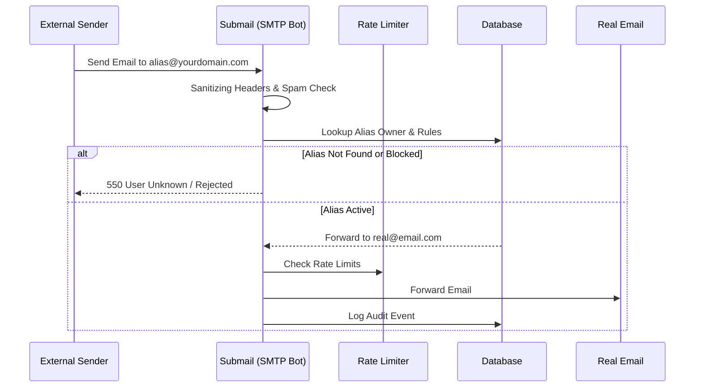

# Submail System

[](https://nextjs.org/)
[](https://www.typescriptlang.org/)
[](https://www.prisma.io/)
[](https://upstash.com/)
[](LICENSE)
[](https://github.com/RichardLitt/standard-readme)

> A Secure, Self-Hosted Email Alias System for Discord Communities.

## Table of Contents

- [Introduction](#introduction)
- [Architecture](#architecture)
- [Features](#features)
- [Installation and Setup](#installation-and-setup)
- [Configuration](#configuration)
- [Deployment](#deployment)
- [Usage](#usage)
- [API](#api)
- [Maintainers](#maintainers)
- [License](#license)

## Introduction

**Submail** is a privacy-focused email forwarding system designed for Discord communities. It allows designated users (e.g., your guild members) to create unlimited email aliases (like `netflix@yourdomain.com`) that forward to their real email address (`user@gmail.com`).

Unlike standard forwarding services, Submail is **Discord-gated**, meaning only users who are members of your specific Discord server can access the dashboard and create aliases.

## Architecture

The system consists of two main logical components:

1.  **Web Dashboard (`apps/web`)**: A Next.js 14 application providing the user interface for managing aliases.
2.  **SMTP Bot (`apps/bot`)**: A Node.js application that handles incoming emails on Port 25, processes them, and forwards them.

### Data Flow



### Database Schema
The database is managed by **Prisma** and shared between both apps. core models include:
-   `User`: Stores Discord ID and profile info.
-   `Alias`: Stores created email aliases and their status (Active/Paused).
-   `Log`: Audit trail of processed emails.

## Features

-   **Discord Gate**: Strict access control via Discord Server membership.
-   **Hybrid Architecture**: Next.js 14 Dashboard + Node.js Custom SMTP Server.
-   **Security**: SRS-Lite forwarding, CSP, Rate Limiting, and PII Masking.
-   **Deliverability**: Full support for SPF, DKIM, and DMARC.
-   **Rate Limiting**: Uses Upstash Redis to prevent abuse of API endpoints and email flooding.

## Installation and Setup

### Prerequisites

-   **Node.js**: v20 or higher (v22 Recommended).
-   **npm**: Comes with Node.js.
-   **Discord Account**: For creating a customized application at [Discord Developer Portal](https://discord.com/developers/applications).

### Step-by-Step Installation

1.  **Clone the Repository**
    ```bash
    git clone https://github.com/minseo0388/submail.git
    cd submail
    ```

2.  **Install Dependencies**
    Submail uses a monorepo structure. Run `npm install` in the root directory.
    ```bash
    npm install
    ```

3.  **Environment Configuration**
    Copy the example environment file to `.env`:
    ```bash
    cp .env.example .env
    ```
    *See [Configuration](#configuration) section below for details.*

4.  **Database Setup**
    Initialize the database (SQLite by default):
    ```bash
    npx prisma db push
    ```

5.  **Start Development Server**
    Run both the web dashboard and bot simultaneously:
    ```bash
    npm run dev
    ```
    -   **Web Dashboard**: [http://localhost:3000](http://localhost:3000)
    -   **SMTP Server**: Port 25

    > **Note on Port 25**: Binding to port 25 often requires elevated privileges/root. On Linux, you may need to use `sudo` or capabilities (`setcap`). On Windows, ensure no other service is blocking it.

## Configuration

The `.env` file controls every aspect of the system.

### Core & Database
| Variable | Required | Description | Example |
| :--- | :---: | :--- | :--- |
| `DATABASE_URL` | ✅ | Database connection string. | `file:./dev.db` |
| `AUTH_SECRET` | ✅ | Random string for session encryption. | `super-secret` |
| `WEB_URL` | ✅ | Public URL of web dashboard. | `https://mail.co` |
| `NEXTAUTH_URL` | ✅ | Canonical URL for NextAuth. | `https://mail.co` |

### Discord Authentication
| Variable | Required | Description |
| :--- | :---: | :--- |
| `DISCORD_CLIENT_ID` | ✅ | Application ID from Discord Developer Portal. |
| `DISCORD_CLIENT_SECRET` | ✅ | Client Secret from Discord Developer Portal. |
| `DISCORD_BOT_TOKEN` | ✅ | Bot Token. |
| `DISCORD_GUILD_ID` | ⚠️ | Only members of this Guild ID can log in. |

### Mail Server
| Variable | Required | Default | Description |
| :--- | :---: | :--- | :--- |
| `SMTP_DOMAIN` | ✅ | - | Domain for aliases (e.g., `example.com`). |
| `SMTP_PORT` | ❌ | `25` | Port to listen for incoming emails. |

### Rate Limiting (Optional)
| Variable | Description |
| :--- | :--- |
| `UPSTASH_REDIS_REST_URL` | HTTPS URL for Upstash Redis. |
| `UPSTASH_REDIS_REST_TOKEN` | REST Token for Upstash Redis. |

## Deployment

### Option 1: Docker Compose (Recommended)

This is the easiest way to get everything running on a VPS.

1.  **Clone the repo** on your server.
2.  **Create `.env`** file with production values.
3.  **Run Docker Compose**:
    ```bash
    docker-compose up -d
    ```

### Option 2: Oracle Cloud (Free Tier)

-   **Instance**: VM.Standard.A1.Flex (ARM) with 4 OCPUs and 24GB RAM.
-   **Network**: **CRITICAL**. You must open Port 25 in two places:
    1.  **Oracle VCN Security List**: Add Ingress Rule for TCP Port 25 (0.0.0.0/0).
    2.  **Instance Firewall**: `sudo iptables -I INPUT 6 -m state --state NEW -p tcp --dport 25 -j ACCEPT` (or `ufw allow 25`).

### Option 3: Manual VPS Deployment

1.  **Install Node.js & PM2**:
    ```bash
    curl -fsSL https://deb.nodesource.com/setup_20.x | sudo -E bash -
    sudo apt install -y nodejs
    sudo npm install -g pm2
    ```
2.  **Build & Run**:
    ```bash
    npm install && npm run build
    pm2 start npm --name "submail-web" -- start
    pm2 start npm --name "submail-bot" -- start
    ```
3.  **Permissions**:
    If `submail-bot` fails to bind to port 25, grant Node.js permissions:
    ```bash
    sudo setcap 'cap_net_bind_service=+ep' $(which node)
    ```

### DNS Records

For the system to receive emails, configure these DNS records:

| Type | Host | Value | Purpose |
| :--- | :--- | :--- | :--- |
| `A` | `mail` | `<Your VPS IP>` | Points subdomain to server |
| `MX` | `@` | `10 mail.yourdomain.com` | Directs email to your server |
| `TXT` | `@` | `v=spf1 mx -all` | SPF Record |
| `TXT` | `_dmarc` | `v=DMARC1; p=quarantine;` | DMARC Policy |

## Usage

1.  **Access Dashboard**: Go to your deployed URL (e.g., `https://mail.yourdomain.com`).
2.  **Login**: Authenticate with Discord.
3.  **Create Alias**: Click "New Alias" and choose a prefix (e.g., `netflix`).
4.  **Test**: Send an email from a different address (like `fake@yahoo.com`) to `netflix@yourdomain.com`. It should arrive in your Discord-linked email inbox.

## API

### System Health

`GET /api/health`

```json
{
  "db": "healthy",
  "redis": "healthy",
  "smtp": "healthy",
  "status": "ok"
}
```

## Maintainers

Made with ❤️ by Choi Minseo

## License

[Apache 2.0](LICENSE) © Choi Minseo
