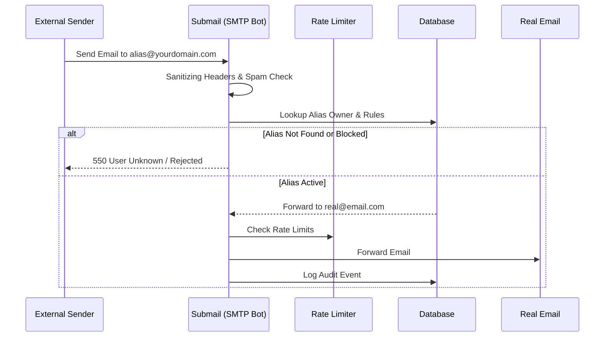

# Submail System


**A Secure, Self-Hosted Email Alias System for Discord Communities.**

[Architecture](#architecture) • [Features](#features) • [Configuration](#configuration-reference) • [Deployment](#deployment)

---

## 📖 Introduction

**Submail** is a privacy-focused email forwarding system designed for Discord communities. It allows designated users (e.g., your guild members) to create unlimited email aliases (like `netflix@yourdomain.com`) that forward to their real email address (`user@gmail.com`).

Unlike standard forwarding services, Submail is **Discord-gated**, meaning only users who are members of your specific Discord server can access the dashboard and create aliases.

---

## 🏗️ Architecture

The system consists of two main components: the **Web Dashboard** (Next.js) for management and the **SMTP Bot** (Node.js) for handling email traffic.



---

## 🚀 Features Deep Dive

### 🔐 1. Discord Gate (Identity & Access)
-   **Strict Membership Check**: Logins are only permitted if the user holds a valid token and is a member of the configured `DISCORD_GUILD_ID`.
-   **Security**: Uses server-side token validation to prevent client-side spoofing.
-   **Privacy**: Your Discord ID is hashed or mapped to an internal UUID (`providerId` vs `id`), ensuring internal database IDs are never exposed.

### 🛡️ 2. Defense-in-Depth Security
-   **CSP (Content Security Policy)**: Blocks malicious scripts and XSS attacks using `strict-dynamic` rules (Report-Only mode supported).
-   **HSTS & Secure Cookies**: Forces HTTPS and prevents cookie theft via `SameSite=Lax` and `HttpOnly`.
-   **Rate Limiting**: Protects the API and Mail Server using a **Sliding Window** algorithm backed by Upstash Redis.
-   **Fail-Safe**: If the database or Redis goes down, the system defaults to a safe state (Fail-Open for availability, Fail-Close for critical auth).

### 📧 3. Mail Engine
-   **Spam Filtering**: Automatically rejects emails with excessive URLs or known spam keywords.
-   **Header Sanitization**: Strips dangerous headers (e.g., `Bcc`, `X-PHP-Originating-Script`) to prevent injection attacks.
-   **Resilience**: Implements **Exponential Backoff Retry** (2s, 4s, 8s) to ensure mail delivery even during momentary network glitches.

---

## 🛠️ Technology Stack

| Component | Technology | Purpose |
| :--- | :--- | :--- |
| **Frontend** | **Next.js 14** (App Router) | React Server Components, efficient rendering. |
| **Backend** | **Next.js API Routes** | Serverless functions for Management API. |
| **Mail Server** | **Node.js + Nodemailer** | Custom SMTP server listening on Port 25. |
| **Database** | **SQLite / Prisma** | Lightweight relational data storage. |
| **Cache/Limit** | **Upstash Redis** | Distributed rate limiting and session store. |
| **Styling** | **Tailwind CSS** | Rapid UI development. |

---

## ⚙️ Configuration Reference

The `.env` file controls every aspect of the system.

### Core & Identity
| Variable | Required | Description |
| :--- | :--- | :--- |
| `DATABASE_URL` | ✅ | Connection string (e.g., `file:./dev.db`). |
| `AUTH_SECRET` | ✅ | Random string for signing session cookies. |
| `NEXTAUTH_URL` | ✅ | Full URL of your dashboard (e.g., `https://mail.u.com`). |

### Discord OAuth
| Variable | Required | Description |
| :--- | :--- | :--- |
| `DISCORD_CLIENT_ID` | ✅ | From Discord Developer Portal. |
| `DISCORD_CLIENT_SECRET` | ✅ | From Discord Developer Portal. |
| `DISCORD_BOT_TOKEN` | ✅ | From Discord Bot Settings. |
| `DISCORD_GUILD_ID` | ⚠️ | **Crucial**: The Server ID allowing access. |

### Mail & Redis
| Variable | Required | Description |
| :--- | :--- | :--- |
| `SMTP_DOMAIN` | ✅ | The domain aliases are created on (e.g., `example.com`). |
| `SMTP_PORT` | Optional | Port to listen on (Default: 25). |
| `UPSTASH_REDIS_REST_URL` | Optional | For Rate Limiting. |
| `UPSTASH_REDIS_REST_TOKEN` | Optional | For Rate Limiting. |

---

## 📦 Deployment Guides

### Option A: Vercel (Web Dashboard Only)
Perfect for the management dashboard, but **cannot run the SMTP server**.
1.  Fork repo -> Import to Vercel.
2.  Set Environment Variables.
3.  Deploy.
4.  *Note: You will need a separate VPS for the `apps/bot` component.*

### Option B: VPS / Docker (Recommended)
Runs the full stack (Web + Mail) in one place.

1.  **Clone & Setup**:
    ```bash
    git clone https://github.com/minseo0388/submail.git
    cd submail
    cp .env.example .env
    ```

2.  **Start Services**:
    ```bash
    # Install Deps
    npm install
    
    # Sync DB
    npx prisma db push
    
    # Build
    npm run build
    
    # Run pm2 or docker
    npm run start
    ```

3.  **DNS Records**:
    -   **A Record**: `@` -> Your VPS IP.
    -   **MX Record**: `@` -> `mail.yourdomain.com` (Priority 10).

---

## 🩺 System Health

You can monitor the status of the system via the Health API:
`GET /api/health`

```json
{
  "db": "healthy",
  "redis": "healthy",
  "smtp": "healthy",
  "status": "ok"
}
```

---

Made with ❤️ by Choi Minseo
